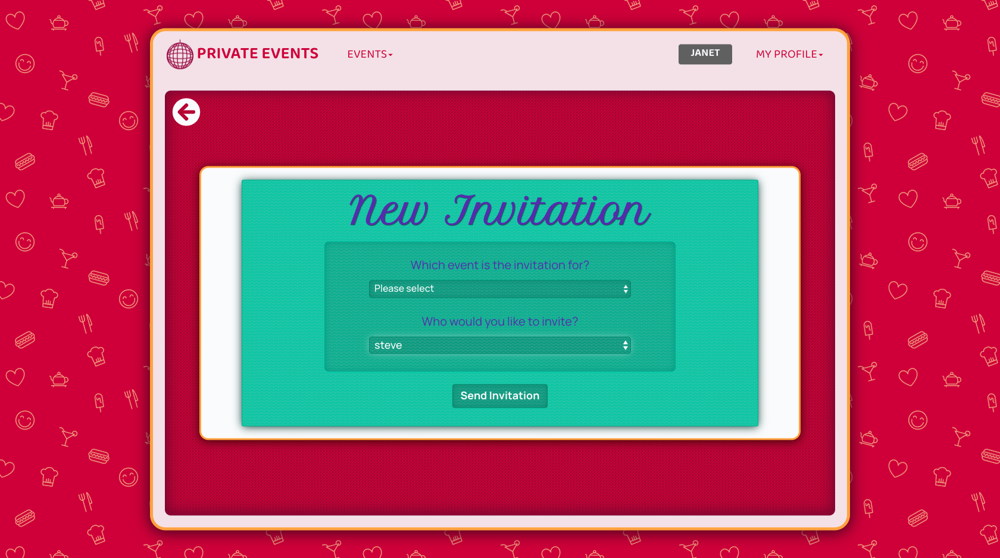

# 🔐 MembersOnly - Rolling Our Own Authentication

This project is part of a series of projects to be completed by students of [Microverse](https://www.microverse.org/).

This project tasked us with building an event building site similar to that of [Eventbrite](https://www.eventbrite.co.uk/). Functionality would include:
  - The ability to create new events with a name, date and time
  - The ability to invite other users to your events
  - The ability to rsvp to events you've been invited to
  - The ability to see all your upcoming and past events you've either attended or been invited to

The clear focus here then, is on model associations.

***********

## 🎥 Previews

> Private Events Welcome Page

******

> The signup page for 'Private Events'. Only a name is required for signup in this current version.

*******

> The Sign In page - requiring only a name in this current version.

******

> The user's profile page. Here the user can see their upcoming events they have RSVP'd to and have created, their invitations and their past events. Each individual list scrolls independently and the counters in the top right update in real time.

********

> Creating a new invitation to an event. Event selection (the first field) display's only events the current user has created. The guest is a multiple select field with every user (bar the current user) avaiable for selection.

********

> The invitation RSVP page. The invitation's event title, event description and event host are all dynamically populated.

********

## 🎯 The Project Brief

The specifications and the guides to the project can be found The Odin Project's [Project 2: Members Only!](https://www.theodinproject.com/courses/ruby-on-rails/lessons/authentication) page.

This project focuses heavily on authentication in web apps. Specifically, in this project we are given the task to create our own authentication system versus using pre-existing authentication solutions such as [Devise](https://github.com/heartcombo/devise). This proves to be an invaluable lesson in understanding exactly how authentication systems work under the hood.

The authentication systems implemented into this project include:
  - User authentication - Password encryption and password digest storage to avoid storing raw user passwords
  - Cookies - Session and remember me cookies for perpetuation of user authentication
  - Before filters preventing unauthorised users from performing higher level actions like seeing who created which posts

Furthermore, the use of cookies allow us to dynamically serve different content (and links) to the user depending on if they have been authenticated (signed in) or not.

## 🛠️ Technologies & Languages Used

- Ruby 2.6.5
- Ruby on Rails 6.0.2.1
- Bootstrap 4.3.1
- Rubocop 0.79.0
- Stickler CI

## 🔰 Setup & Usage

### Setup
In order to get this webpage up and running, you may have to do a little set up first.
  1. Make sure you have both [Ruby](https://www.ruby-lang.org/en/documentation/installation/) and Ruby on Rails ([Mac](https://gorails.com/setup/osx/10.15-catalina) • [Linux](https://gorails.com/setup/ubuntu/19.10) • [Windows](https://gorails.com/setup/windows/10)) installed.
  2. Download this repo!
  3. `cd` into the root directory of wherever you download this repo. [What does 'cd' mean?](https://www.macworld.com/article/2042378/master-the-command-line-navigating-files-and-folders.html)
  4. In your terminal window, enter `rails server` to start the server.
  5. Now navigate to [localhost:4000](localhost:4000) in your browser to start playing with the webpages!

## 🕺🏽 Contributions, Issues & Forking

If you have any issues setting up the project or you come across any unintended bugs or problems, please do submit an issue to the [Members-Only-Authentication](https://github.com/Rhelli/Members-Only-Authentication/issues) page.

If you want to make your own changes, modifications or improvements to our project, go ahead and Fork it!
1. [Fork it](https://github.com/Rhelli/Members-Only-Authentication/fork)
2. Create your working branch (git checkout -b [choose-a-name])
3. Commit your changes (git commit -am 'what this commit will fix/add/improve')
4. Push to the branch (git push origin [chosen-name])
5. Create a new Pull Request

## 👨🏽‍💻 💂🏽‍♂️ Creators

Rory Hellier - [GitHub](https://github.com/Rhelli)

## 🎁 Show Your Support

Give a ⭐️ if you like this project!