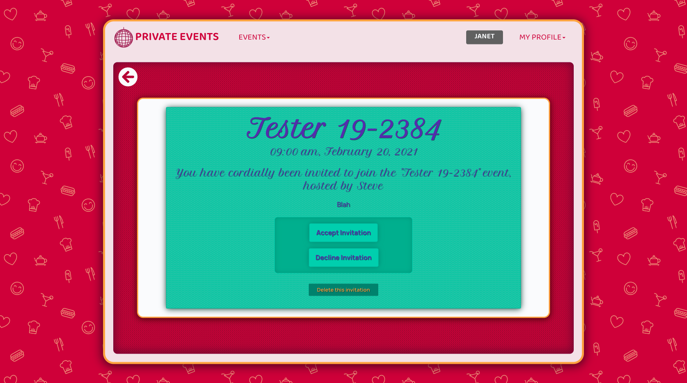

# 🎈 Private Events - Associations

This project is part of a series of projects to be completed by students of [Microverse](https://www.microverse.org/).

This project tasked us with building an event building site similar to that of [Eventbrite](https://www.eventbrite.co.uk/). Functionality would include:
  - The ability to create new events with a name, date and time
  - The ability to invite other users to your events
  - The ability to rsvp to events you've been invited to
  - The ability to see all your upcoming and past events you've either attended or been invited to

The clear focus here then, is on model associations.

> N.B. The invitation creation page is available to visit in this version however functionality to send invitations to other users has not yet been implemented.

## ⚒️ The Project Brief

The specifications and the guides to the project can be found The Odin Project's [Associations](https://www.theodinproject.com/courses/ruby-on-rails/lessons/associations) page.

The focus of this project is on forming the correct associations between different models. Namely, in this project, we have three main models to work with - users, events and invitations. A brief breakdown as to the associations:
  - Users can have many events as both hosts and as party attendees
  - Events can have many users as attendees
  - Invitations can have one owner and one creator.

From examining the above, it should be clear that what is therefore required is a correct use of many-to-many relationships and foreign keys.

As an additional requirement to this project (not listed on the TOP project page) is the implementation of TDD with the use of RSpec and Capybara.

***********

## 🖼️ Previews

> Private Events Welcome Page

******

> The signup page for 'Private Events'. Only a name is required for signup in this current version.

*******

> The Sign In page - requiring only a name in this current version.

******

> The Event Index page where all past and upcoming events can be viewed.

******

> The user's profile page. Here the user can see their upcoming events they have RSVP'd to and have created, their invitations and their past events. Each individual list scrolls independently and the counters in the top right update dynamically.

********

> Creating a new invitation to an event. Event selection (the first field) display's only events the current user has created. The guest is a multiple select field with every user (bar the current user) avaiable for selection.

********

> The invitation RSVP page. The invitation's event title, event description and event host are all dynamically populated.

********

> The event show page, where you can see invited guests as well as those who have confirmed their attendance via RSVP. Hosts of the event are able to send new invitations via the 'Invite Guests' link in the top right hand corner.

********

## 🔬 Technologies & Languages Used

- Ruby 2.6.5
- Ruby on Rails 6.0.2.2
- Bootstrap 4.3.1
- SASS/CSS3
- jQuery
- RSpec 3.9
- Capybara
- Rubocop 0.79.0
- Stickler CI

## 🔰 Setup & Usage

### Setup
In order to get this webpage up and running, you may have to do a little set up first.
  1. Make sure you have both [Ruby](https://www.ruby-lang.org/en/documentation/installation/) and Ruby on Rails ([Mac](https://gorails.com/setup/osx/10.15-catalina) • [Linux](https://gorails.com/setup/ubuntu/19.10) • [Windows](https://gorails.com/setup/windows/10)) installed.
  2. Download this repo!
  3. `cd` into the root directory of wherever you download this repo. [What does 'cd' mean?](https://www.macworld.com/article/2042378/master-the-command-line-navigating-files-and-folders.html)
  4. In your terminal window, enter `rails server` to start the server.
  5. Now navigate to [localhost:4000](localhost:4000) in your browser to start playing around with the webpages!

Alternatively if you'd like to confirm the entire project is passing testing:
  1. **`cd`** into this repository in your terminal
  2. Enter **`bundle exec rspec`** to run all tests

## 🍻 Contributions, Issues & Forking

If you have any issues setting up the project or you come across any unintended bugs or problems, please do submit an issue to the [Members-Only-Authentication](https://github.com/Rhelli/Private-Events-App/issues) page.

If you want to make your own changes, modifications or improvements to our project, go ahead and Fork it!
1. [Fork it](https://github.com/Rhelli/Private-Events-App/fork)
2. Create your working branch (git checkout -b [choose-a-name])
3. Commit your changes (git commit -am 'what this commit will fix/add/improve')
4. Push to the branch (git push origin [chosen-name])
5. Create a new Pull Request

## 🕺🏽 Creator

Rory Hellier - [GitHub](https://github.com/Rhelli)

## 👏🏽 Show Your Support

Give a ⭐️ if you like this project!